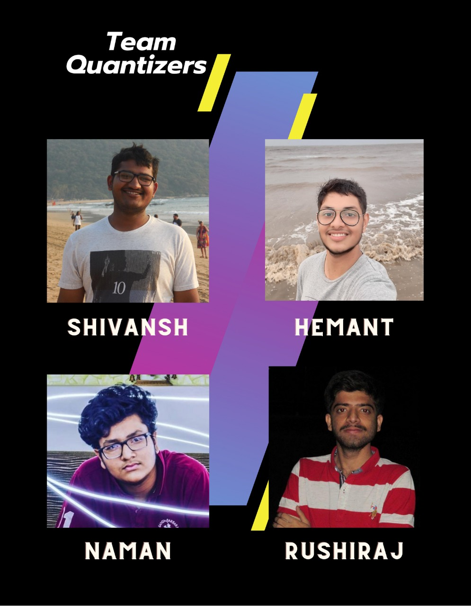

# Student Investment Portfolio (SIP) [(Video Demo)](https://www.youtube.com/watch?v=-NEdES7bYRQ)
## Aim
***This web app is the one-stop destination for all your investment needs and leads to a path of financial freedom.*** 
We, the ***Quantizers*** team, have created this web application focusing on **students** and people coming from *low-income class*.

## Core Finance Concepts & Portfolio Optimization Techniques
We have carefully selected handpicked stocks using **Fundamental Analysis** method to screen those who shined apart from the hundreds of other stocks present in the **Indian Stock Indices**.

We have implemented following portfolio optimization techniques from scratch -
- ***Markowitz Model*** - In this model, we can have a portfolio with variable returns for a fixed variance. As the model speaks for itself, we apply this model by fixing the variance to a set value and optimizing it to achieve the highest returns.
- ***Minimum Variance*** - In this technique, we select stocks that generate steady revenue and minimize the portfolio variance to achieve a portfolio that comprises equity, which can hold their own even in the darkest of times.
- ***Sharpe Ratio Maximization*** - In this technique, we maximize *sharpe ratio* using **Monte Carlo Simulations** to achieve an aggressive portfolio, which will result in an increment of your net worth by a considerable margin, but they also come with significant risk.

## Features
- Track Investments
- Optimize Portfolio
- Obtain Live Stats

 

## Tech Stack
### Tools & Technologies
- Flask (Micro Web framework of python)
- Bootstrap (CSS framework)
- PostgreSQL (Relational Database Management System)

### Languages
- Python
- HTML
- CSS

## Team Quantizers

